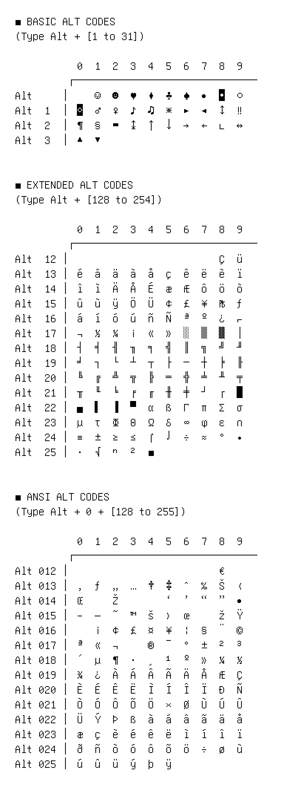

# Alt Code Cheat Sheet

■ BASIC ALT CODES
(Type Alt + [1 to 31])

         0 1 2 3 4 5 6 7 8 9
         ┌───────────────────

Alt │ ☺ ☻ ♥ ♦ ♣ ♠ • ◘ ○
Alt 1 │ ◙ ♂ ♀ ♪ ♫ ☼ ► ◄ ↕ ‼
Alt 2 │ ¶ § ▬ ↨ ↑ ↓ → ← ∟ ↔
Alt 3 │ ▲ ▼

■ EXTENDED ALT CODES
(Type Alt + [128 to 254])

         0 1 2 3 4 5 6 7 8 9
         ┌───────────────────

Alt 12 │ Ç ü
Alt 13 │ é â ä à å ç ê ë è ï
Alt 14 │ î ì Ä Å É æ Æ ô ö ò
Alt 15 │ û ù ÿ Ö Ü ¢ £ ¥ ₧ ƒ
Alt 16 │ á í ó ú ñ Ñ ª º ¿ ⌐
Alt 17 │ ¬ ½ ¼ ¡ « » ░ ▒ ▓ │
Alt 18 │ ┤ ╡ ╢ ╖ ╕ ╣ ║ ╗ ╝ ╜
Alt 19 │ ╛ ┐ └ ┴ ┬ ├ ─ ┼ ╞ ╟
Alt 20 │ ╚ ╔ ╩ ╦ ╠ ═ ╬ ╧ ╨ ╤
Alt 21 │ ╥ ╙ ╘ ╒ ╓ ╫ ╪ ┘ ┌ █
Alt 22 │ ▄ ▌ ▐ ▀ α ß Γ π Σ σ
Alt 23 │ µ τ Φ Θ Ω δ ∞ φ ε ∩
Alt 24 │ ≡ ± ≥ ≤ ⌠ ⌡ ÷ ≈ ° ∙
Alt 25 │ · √ ⁿ ² ■

■ ANSI ALT CODES
(Type Alt + 0 + [128 to 255])

         0 1 2 3 4 5 6 7 8 9
         ┌───────────────────

Alt 012 │ €  
Alt 013 │ ‚ ƒ „ … † ‡ ˆ ‰ Š ‹
Alt 014 │ Œ Ž ‘ ’ “ ” •
Alt 015 │ – — ˜ ™ š › œ ž Ÿ
Alt 016 │ ¡ ¢ £ ¤ ¥ ¦ § ¨ ©
Alt 017 │ ª « ¬ ® ¯ ° ± ² ³
Alt 018 │ ´ µ ¶ · ¸ ¹ º » ¼ ½
Alt 019 │ ¾ ¿ À Á Â Ã Ä Å Æ Ç
Alt 020 │ È É Ê Ë Ì Í Î Ï Ð Ñ
Alt 021 │ Ò Ó Ô Õ Ö × Ø Ù Ú Û
Alt 022 │ Ü Ý Þ ß à á â ã ä å
Alt 023 │ æ ç è é ê ë ì í î ï
Alt 024 │ ð ñ ò ó ô õ ö ÷ ø ù
Alt 025 │ ú û ü ý þ ÿ

## Visual Fallback Reference

If your system lacks the required fonts to render these characters properly, use the image below as a visual guide.

---

**🌐 Live Web Version**  
This repository serves as a static, offline reference. If you prefer a web-based UI with instant search, category filtering, and one-click copying, you can use the live directory at [SymbolHut.com](https://symbolhut.com).
